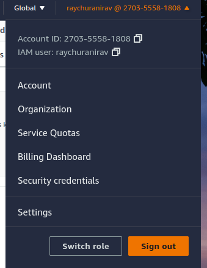

# Week 0 — Billing and Architecture

## Required Homework

### Installing AWS CLI in GITPOD

I am using gitpod account. I have installed AWS CLI in my gitpod account. To install the aws cli I have installed the aws cli into the gitpod via some commands

```
url "https://awscli.amazonaws.com/awscli-exe-linux-x86_64.zip" -o "awscliv2.zip"
unzip awscliv2.zip
sudo ./aws/install
```
After that I can use the AWS CLI commands but in order to do that I have to configure some things into my gitpod. There are some environment variables we have to set into the gitpod account so that I can use my AWS account in my gitpod. The environment variables are "AWS_ACCESS_KEY_ID" and "AWS_SECRET_ACCESS_KEY". In order to set those things I have to create credentials into the IAM account which I am using for this bootcamp. I did this from the AWS console.
- Went to AWS Console
- Searched the IAM Service
- Went to the users
- Select my IAM user
- Went to Security Credentials
- *Created ACCESS KEY*

That's where I found values of my environment variables which I have to set into the gitpod account.

I set those environment variables via export command

```
export AWS_ACCESS_KEY_ID=ACCESSKEYID
export AWS_SECRET_ACCESS_KEY=MYSECRETKEY

```
And after that I tested that my AWS account is configured or not so I used this command 

```
aws sts get-caller-identity 
```
The output of the command is 

```
{
    "UserId": "AIDAT54TSZNYB4PNXWPQS",
    "Account": "270355581808",
    "Arn": "arn:aws:iam::270355581808:user/raychuranirav"
}
```
In order to proove that I am using this account I am sharing this screenshoot



To use AWS CLI in gitpod I have to save my environment variables to gitpod securely to do that I used this commands
```
gp env AWS_ACCESS_KEY_ID=MyAccessID
gp env AWS_SECRET_ACCESS_KEY=MySecretKey
```

### Preparing for creating budget

To create any budget into the AWS I have to create anvironment variable which is my account id
in order to do that I used this command
```
gp env AWS_ACCOUNT_ID=$(aws sts get-caller-identity --query Account --output text)
```

### Creating 10 Dollar Budget
In order to create budget from AWS CLI, I have to use this command
```
aws budgets create-budget --account-id MY ID --budget file://pera1.json --notifications-with-subscribers file://pera2.json
```
To create those files I used this [link](https://docs.aws.amazon.com/cli/latest/reference/budgets/create-budget.html) as reference, and created those files and created budget of 10 dollars. Here is the proof of it


