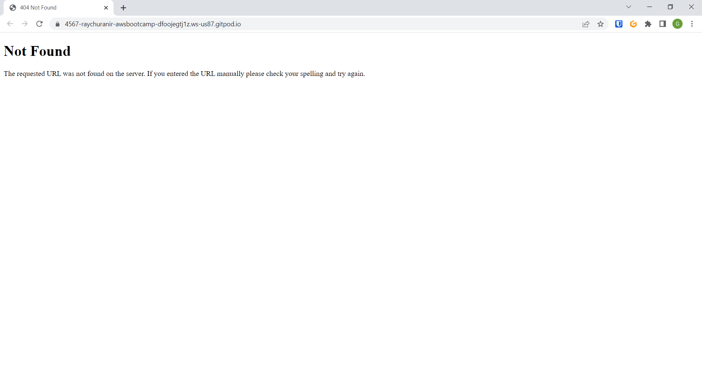
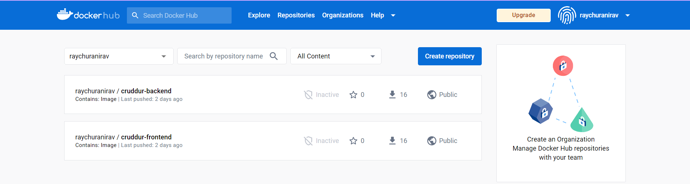
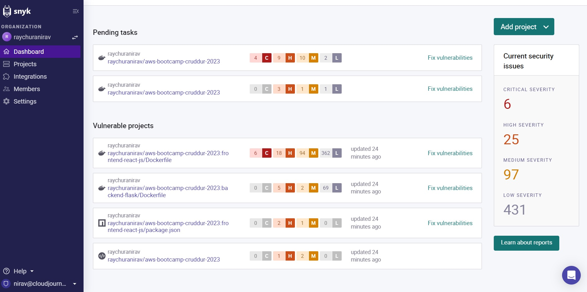
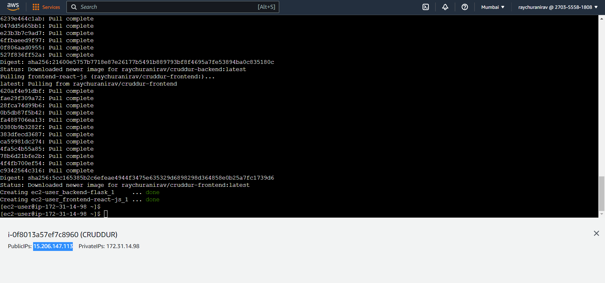
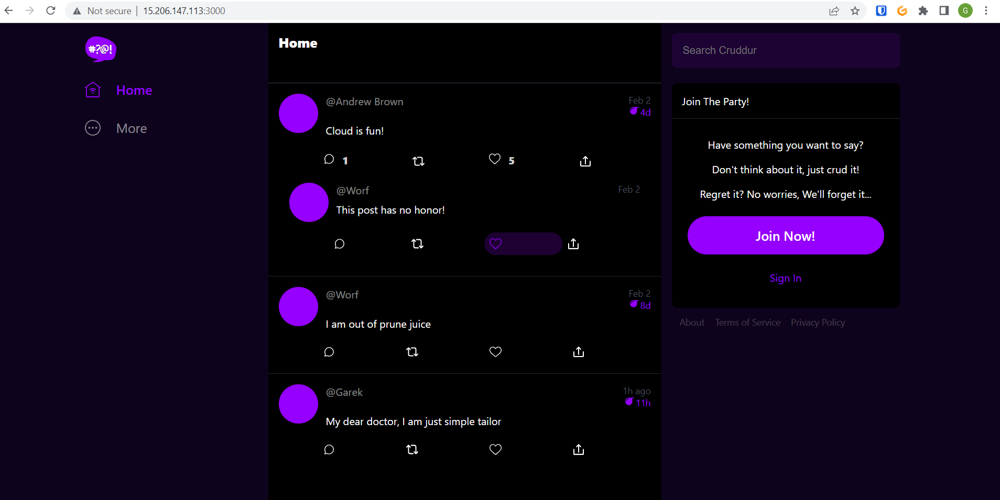

# Week 1 — App Containerization

## REQUIRED HOMEWORK 

**Note : In some code you will find explaination so that you can know that I did the research for those code the actual code is without explanation** 

I watched the live video and done things which I saw on the video and did some changes into the gitpod.

### Created Dockerfile into the backend-flask folder and written this code into the file


```
# This code will fetch the specified python image from the docker hub
FROM python:3.10-slim-buster

WORKDIR /backend-flask

# This will copy the requirements.txt file into the image. This txt file is currently inside the backend-flask folder
COPY requirements.txt requirements.txt

# This will install all programs/softwares which is required to run our backend 
RUN pip3 install -r requirements.txt

# This will copy every folder inside the image which I am trying to make
COPY . .


ENV FLASK_ENV=development

# This will expose the port specified in our case its 4567
EXPOSE ${PORT}

# This will run our backend via flask module of python
CMD [ "python3", "-m" , "flask", "run", "--host=0.0.0.0", "--port=4567"]
```
* From the Dockerfile I made a docker container to run our backend in order to do that I run following command
```docker
docker build -t  backend-flask ./backend-flask
```

* Ran the container via following command

```sh
# This command is to run the docker will change the entrypoint to backend-flask via -it, remove the image after completing test/whene I exit via --rm, 
# Creating and passing the environment variables FRONTEND_URL and BACKEND_URL via -e , exposing the port 4567 from the inside to outside (Basically its port forwarding) running the container backend-flask at the end I can run the same command with -d to run it in background but I will not do it right now
docker run --rm -p 4567:4567 -it -e FRONTEND_URL='*' -e BACKEND_URL='*' backend-flask
```

After running the command I can open the backend into the browser via URL which is present into the gitpod "PORTS". I made the URL public and I opened the URL and found that its giving me 404 error which is good sign it means the backend is running



* Created Dockerfile into the frontend-react-js folder and save it with following code

```docker
# This will fetch the specified node image
FROM node:16.18

# This will set the environment variable 
ENV PORT=3000

# This will copy the whole frontend-reeact-js folder into the container 
COPY . /frontend-react-js

WORKDIR /frontend-react-js

# This will install the npm software/program into the container
RUN npm install

# This will expose the port
EXPOSE ${PORT}

# This will start the frontend
CMD ["npm", "start"]
```

Before running the docker build command I have to install the npm into gotpod workspace so I did it via following command

```
npm install
```

I did this to test the backend I run following command to run the frontend 

```
# To build the image
docker build -t frontend-react-js ./frontend-react-js

# To run the container exposing the port 3000
docker run -p 3000:3000 frontend-react-js
```
After the above command I can see the frontend so its working but it wasn't connected to the backend. In order to run both frontend and backend togather I am making a docker-compose.yml file in the project directory with following code

```yml
# This is the version which I am using to run the docker-compose file 
version: "3.8"

# Here I am declaring services which is backend-flask and frontend-react-js
services:
  backend-flask:
  
    # Here I am passing the environtment variables which we have to pass to use this image 
    environment:
      FRONTEND_URL: "https://3000-${GITPOD_WORKSPACE_ID}.${GITPOD_WORKSPACE_CLUSTER_HOST}"
      BACKEND_URL: "https://4567-${GITPOD_WORKSPACE_ID}.${GITPOD_WORKSPACE_CLUSTER_HOST}"
    
    # This will build/rebuild the image if there is no image or I made some changes into the code
    build: ./backend-flask
    
    # Exposing the ports here which is basically port forwarding
    ports:
      - "4567:4567"
   
   # Here I am attaching the volume of outside of the container to the inside of container its basically used for persistent data    
    volumes:
      - ./backend-flask:/backend-flask

  # All the things will be same for frontend as backend 
  frontend-react-js:
    environment:
      REACT_APP_BACKEND_URL: "https://4567-${GITPOD_WORKSPACE_ID}.${GITPOD_WORKSPACE_CLUSTER_HOST}"
    build: ./frontend-react-js
    ports:
      - "3000:3000"
    volumes:
      - ./frontend-react-js:/frontend-react-js

# Here I am making network for docker
networks: 
  internal-network:
    driver: bridge
    name: cruddur
```

After that it will be easy to run backend and frontend at the same time I have to just use to following command to run those

```
# Here I am using the -d for running it to the background
docker compose up -d
```
I can see that frontend is connacted to the backend


### Added the dynamodb and postgres into docker compose file

In order to run the dynamodb via container I added the following script into the docker compose file

```docker
dynamodb-local:
    # https://stackoverflow.com/questions/67533058/persist-local-dynamodb-data-in-volumes-lack-permission-unable-to-open-databa
    # We needed to add user:root to get this working.
    user: root
    command: "-jar DynamoDBLocal.jar -sharedDb -dbPath ./data"
    image: "amazon/dynamodb-local:latest"
    container_name: dynamodb-local
    ports:
      - "8000:8000"
    volumes:
      - "./docker/dynamodb:/home/dynamodblocal/data"
    working_dir: /home/dynamodblocal
```

In order to run the postgres via container I added the following script into docker compose file

```docker
db:
    image: postgres:13-alpine
    restart: always
    environment:
      - POSTGRES_USER=postgres
      - POSTGRES_PASSWORD=password
    ports:
      - '5432:5432'
    volumes: 
      - db:/var/lib/postgresql/data
volumes:
  db:
    driver: local
```

I added follwing script to gidpod.yml file to connect the postgres. Basically this is for installing postgres client to the gitpod so that I can communicate with the postgres via cli

```yml
  - name: postgres
    init: |
      curl -fsSL https://www.postgresql.org/media/keys/ACCC4CF8.asc|sudo gpg --dearmor -o /etc/apt/trusted.gpg.d/postgresql.gpg
      echo "deb http://apt.postgresql.org/pub/repos/apt/ `lsb_release -cs`-pgdg main" |sudo tee  /etc/apt/sources.list.d/pgdg.list
      sudo apt update
      sudo apt install -y postgresql-client-13 libpq-dev
```

After doing it I have to use following command so that I can test that both the dbs are working

```bash
docker compose up -d
```
* Tested that dynamodb and postgres is working
In order to do that I ran following commands
```bash

# This is to create table of dynamodb

aws dynamodb create-table \
    --endpoint-url http://localhost:8000 \
    --table-name Music \
    --attribute-definitions \
        AttributeName=Artist,AttributeType=S \
        AttributeName=SongTitle,AttributeType=S \
    --key-schema AttributeName=Artist,KeyType=HASH AttributeName=SongTitle,KeyType=RANGE \
    --provisioned-throughput ReadCapacityUnits=1,WriteCapacityUnits=1 \
    --table-class STANDARD

# This is to insert something into the dynamodb
aws dynamodb put-item \
    --endpoint-url http://localhost:8000 \
    --table-name Music \
    --item \
        '{"Artist": {"S": "No One You Know"}, "SongTitle": {"S": "Call Me Today"}, "AlbumTitle": {"S": "Somewhat Famous"}}' \
    --return-consumed-capacity TOTAL

# This is to list all of the dynamodb tables
aws dynamodb list-tables --endpoint-url http://localhost:8000

# This is to query the Items from the table Music
aws dynamodb scan --table-name Music --query "Items" --endpoint-url http://localhost:8000

```
Here you can see the output


After that I installed the postgres extention into the gitpod and added it to the gitpod.yml file and tested the connection of postgres and it was success

Here you can see the result


##  Homework Challenges 

### Pushed the docker images into the docker hub

In order to do that I have make an account into the dockerhub website, and create the access token to use it into the cli

Here is you can see that I made an account into the dockerhub even I used the MFA there also to secure it.


In order to push the image into the dockerhub I have to login to dockerhub via cli so I used the following command to do that

```bash
docker login -u raychuranirav -p accesstoken
```
After that I have to tag the images which I want to upload. In order to do that I used following command
Here I am just preparing my images to upload I am not putting any tags and by default it will use latest tag and I am ok with it 

```bash
docker image tag aws-bootcamp-cruddur-2023-backend-flask:latest  raychuranirav/cruddur-backend
docker image tag aws-bootcamp-cruddur-2023-frontend-react-js:latest raychuranirav/crudder-frontend
``` 
After that I pushed the Images via following commands

```bash
docker image push raychuranirav/cruddur-backend:latest
docker image push raychuranirav/cruddur-frontend:latest
```
Here you can see that my images was pushed into the docker hub repo



### Implemented a healthcheck in the V3 Docker compose file

So far I came to know that it has five commands to implement healthcheck into docker compose file
|HEALTH CHECK COMMANDS| USECASES|
|---------------------|---------|
|test| This is for testing if the container is up and running or not I can check via **wget** or **curl** command|
|interval| This is to wait some time before check if the continer is running or not|
|timeout| This command specifies time to wait untill next check will commint if the fitst check is failed|
|retries| This command will specify how many health check will be done|
|start_period|This property specifies the number of seconds your container needs to bootstrap|

The follwing code I have to put inside the docker compose file to run health check for frontend
```
  healthcheck:
      test: curl --fail "https://3000-${GITPOD_WORKSPACE_ID}.${GITPOD_WORKSPACE_CLUSTER_HOST}" || exit 1
      interval: 60s
      retries: 5
      start_period: 20s
      timeout: 10s
```
**Note: This will only work in gitpod**

I used this [resource](https://medium.com/geekculture/how-to-successfully-implement-a-healthcheck-in-docker-compose-efced60bc08e)

### Research best practices of Dockerfiles and attempt to implement it in your Dockerfile

So far I researched the best practices to use docker from the video of ashish and came to know these best security practices

| No. | BEST SECURITY PRACTICES TO USE DOCKER |
|-----|---------------------------------------|
|  1  | Keep Host and Docker updated to the latest security patches |
|  2  | Docker daemon and containers should not run in root user mode (You will see example of this in further journal |
|  3  | Image Vulnerability Scanning (Did this via snyk, You will see image of testing our crudder backend and frontend images/containers |
|  4  | No Sensitive data in docker files or image ( It means no password inside it. If you want to pass the password into docker file use AWS Secrets Manager or similer services ) |
|  5  | Read only file system and volume for docker |
|  6  | Seprate databases for long term storage (I think we are doing it in cruddur) |
|  7  | Use DevSecOps practices while building application security (snyk is one of the tools to do that) |
|  8  | Ensure all code is tested for vulnerabilities before using it for production environment |

Here you can see that I use snyk to search vulnerabilities inside github code and also inside docker images



* Launched an EC2 instance that has docker installed, and pull a container to demonstrate you can run your own docker processes.

I created an ec2 instence with following user data

```bash
#!/bin/bash

# This will update the ec2 instance 
sudo yum update -y

# This will install docker into ec2 instence
sudo yum install docker -y

# This will install pythong3-pip to install docker compose
sudo yum install python3-pip

# This will install docker-compose
sudo pip3 install docker-compose

# This specifies that docker service will run every time when this ec2 instence starts
sudo systemctl enable docker.service

# This command will run the docker services
sudo systemctl start docker.service

```
**Don't forget to press enter at the end of the user data**

When ec2 instence started I connected into it and run following commands

```bash
# To give ec2-user permission to use docker without root (BEST PRACTICE)
sudo usermod -a -G docker ec2-user
id ec2-user
newgrp docker

# This environment variable will be used by docker-compose file 
export ips=$(curl http://169.254.169.254/latest/meta-data/public-ipv4)

# Volumes for frontend and backend
mkdir $HOME/backend-flask
mkdir $HOME/frontend-react-js

# To download docker-compose file directly from my github repo (PS IT IS MY GITHUB REPO)
sudo yum install git -y
git clone https://github.com/raychuranirav/docker-compose-for-crudder.git

# Gitclone command will make a directory/ changing the directory 
cd docker-compose-for-crudder

# Putting the file to home directory
mv docker-compose.yml $HOME/docker-compose.yml

# Changing the directory to Home
cd ..

# RUN THE CONTAINERS TO ENJOY CRUDDER INSIDE EC2
docker-compose up -d

```
Here is the docker compose file I used to run both the containers inside ec2

```
version: "3.8"
services:
  backend-flask:
    environment:
      FRONTEND_URL: "http://${ips}:3000"
      BACKEND_URL: "http://${ips}:4567"
    image: raychuranirav/cruddur-backend
#    build: ./backend-flask
    ports:
      - "4567:4567"
    volumes:
      - ./backend-flask:$HOME/backend-flask
  frontend-react-js:
    environment:
      REACT_APP_BACKEND_URL: "http://${ips}:4567"
    image: raychuranirav/cruddur-frontend
#    build: ./frontend-react-js
    ports:
      - "3000:3000"
    volumes:
      - ./frontend-react-js:$HOME/frontend-react-js

# the name flag is a hack to change the default prepend folder
# name when outputting the image names
networks: 
  internal-network:
    driver: bridge
    name: cruddur
```

**NOTE: In docker-compose.yml file I commented the "build" part because its not needed when I run inside another machine**

**NOTE: I added 3000 and 4567 port inside the security group**

Here is the you can see that I ran those commands inside my ec2 instance and also you can see highlited public ip of my ec2 instence



Here you can see that its running inside the ec2 and also frontend and backend are up and running



