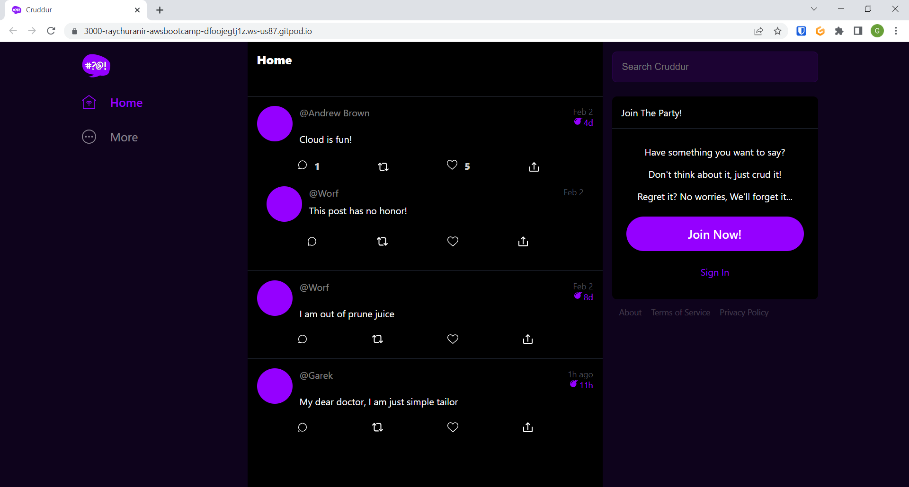
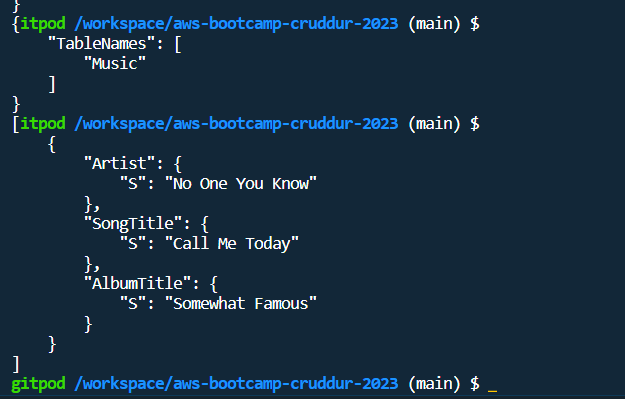
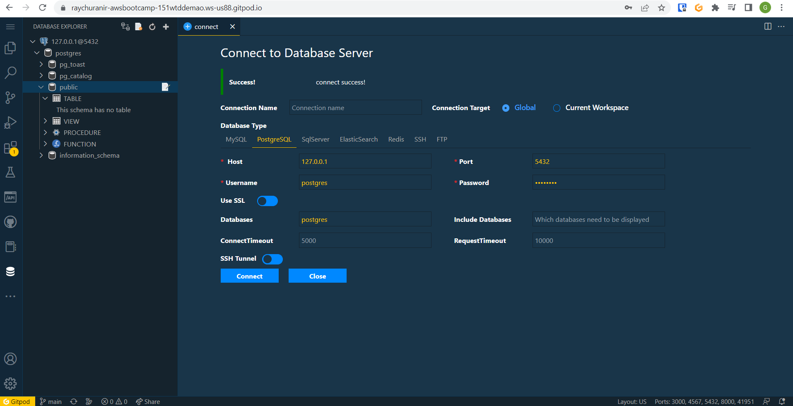

# Week 1 — App Containerization

## REQUIRED HOMEWORK 

**Note : In some code you will find explaination so that you can know that I did the research for those code the actual code is without explanation** 

I watched the live video and done things which I saw on the video and did some changes into the gitpod.

* Created Dockerfile into the backend-flask folder and written this code into the file


```
# This code will fetch the specified python image from the docker hub
FROM python:3.10-slim-buster

WORKDIR /backend-flask

# This will copy the requirements.txt file into the image. This txt file is currently inside the backend-flask folder
COPY requirements.txt requirements.txt

# This will install all programs/softwares which is required to run our backend 
RUN pip3 install -r requirements.txt

# This will copy every folder inside the image which I am trying to make
COPY . .


ENV FLASK_ENV=development

# This will expose the port specified in our case its 4567
EXPOSE ${PORT}

# This will run our backend via flask module of python
CMD [ "python3", "-m" , "flask", "run", "--host=0.0.0.0", "--port=4567"]
```
* From the Dockerfile I made a docker container to run our backend in order to do that I run following command
```docker
docker build -t  backend-flask ./backend-flask
```
* Ran the container via following command

```sh
# This command is to run the docker will change the entrypoint to backend-flask via -it, remove the image after completing test/whene I exit via --rm, 
# Creating and passing the environment variables FRONTEND_URL and BACKEND_URL via -e , exposing the port 4567 from the inside to outside (Basically its port forwarding) running the container backend-flask at the end I can run the same command with -d to run it in background but I will not do it right now
docker run --rm -p 4567:4567 -it -e FRONTEND_URL='*' -e BACKEND_URL='*' backend-flask
```

After running the command I can open the backend into the browser via URL which is present into the gitpod "PORTS". I made the URL public and I opened the URL and found that its giving me 404 error which is good sign it means the backend is running


* Created Dockerfile into the frontend-react-js folder and save it with following code

```docker
# This will fetch the specified node image
FROM node:16.18

# This will set the environment variable 
ENV PORT=3000

# This will copy the whole frontend-reeact-js folder into the container 
COPY . /frontend-react-js

WORKDIR /frontend-react-js

# This will install the npm software/program into the container
RUN npm install

# This will expose the port
EXPOSE ${PORT}

# This will start the frontend
CMD ["npm", "start"]
```

Before running the docker build command I have to install the npm into gotpod workspace so I did it via following command

```
npm install
```
As I did to test the backend I run following command to run the frontend 

```
# To build the image
docker build -t frontend-react-js ./frontend-react-js

# To run the container exposing the port 3000
docker run -p 3000:3000 frontend-react-js
```
After the above command I can see the frontend so its working but it wasn't connected to the backend. In order to run both frontend and backend togather I am making a docker-compose.yml file in the project directory with following code

```yml
# This is the version which I am using to run the docker-compose file 
version: "3.8"

# Here I am declaring services which is backend-flask and frontend-react-js
services:
  backend-flask:
  
    # Here I am passing the environtment variables which we have to pass to use this image 
    environment:
      FRONTEND_URL: "https://3000-${GITPOD_WORKSPACE_ID}.${GITPOD_WORKSPACE_CLUSTER_HOST}"
      BACKEND_URL: "https://4567-${GITPOD_WORKSPACE_ID}.${GITPOD_WORKSPACE_CLUSTER_HOST}"
    
    # This will build/rebuild the image if there is no image or I made some changes into the code
    build: ./backend-flask
    
    # Exposing the ports here which is basically port forwarding
    ports:
      - "4567:4567"
   
   # Here I am attaching the volume of outside of the container to the inside of container its basically used for persistent data    
    volumes:
      - ./backend-flask:/backend-flask

  # All the things will be same for frontend as backend 
  frontend-react-js:
    environment:
      REACT_APP_BACKEND_URL: "https://4567-${GITPOD_WORKSPACE_ID}.${GITPOD_WORKSPACE_CLUSTER_HOST}"
    build: ./frontend-react-js
    ports:
      - "3000:3000"
    volumes:
      - ./frontend-react-js:/frontend-react-js

# Here I am making network for docker
networks: 
  internal-network:
    driver: bridge
    name: cruddur
```

After that it will be easy to run backend and frontend at the same time I have to just use to following command to run those

```
# Here I am using the -d for running it to the background
docker compose up -d
```
I can see that frontend is connacted to the backend



* Added the dynamodb and postgres into docker compose file

In order to run the dynamodb via container I added the following script into the docker compose file

```docker
dynamodb-local:
    # https://stackoverflow.com/questions/67533058/persist-local-dynamodb-data-in-volumes-lack-permission-unable-to-open-databa
    # We needed to add user:root to get this working.
    user: root
    command: "-jar DynamoDBLocal.jar -sharedDb -dbPath ./data"
    image: "amazon/dynamodb-local:latest"
    container_name: dynamodb-local
    ports:
      - "8000:8000"
    volumes:
      - "./docker/dynamodb:/home/dynamodblocal/data"
    working_dir: /home/dynamodblocal
```

In order to run the postgres via container I added the following script into docker compose file

```docker
db:
    image: postgres:13-alpine
    restart: always
    environment:
      - POSTGRES_USER=postgres
      - POSTGRES_PASSWORD=password
    ports:
      - '5432:5432'
    volumes: 
      - db:/var/lib/postgresql/data
volumes:
  db:
    driver: local
```

I added follwing script to gidpod.yml file to connect the postgres. Basically this is for installing postgres client to the gitpod so that I can communicate with the postgres via cli

```yml
  - name: postgres
    init: |
      curl -fsSL https://www.postgresql.org/media/keys/ACCC4CF8.asc|sudo gpg --dearmor -o /etc/apt/trusted.gpg.d/postgresql.gpg
      echo "deb http://apt.postgresql.org/pub/repos/apt/ `lsb_release -cs`-pgdg main" |sudo tee  /etc/apt/sources.list.d/pgdg.list
      sudo apt update
      sudo apt install -y postgresql-client-13 libpq-dev
```

After doing it I have to use following command so that I can test that both the dbs are working

```bash
docker compose up -d
```
* Tested that dynamodb and postgres is working
In order to do that I ran following commands
```bash

# This is to create table of dynamodb

aws dynamodb create-table \
    --endpoint-url http://localhost:8000 \
    --table-name Music \
    --attribute-definitions \
        AttributeName=Artist,AttributeType=S \
        AttributeName=SongTitle,AttributeType=S \
    --key-schema AttributeName=Artist,KeyType=HASH AttributeName=SongTitle,KeyType=RANGE \
    --provisioned-throughput ReadCapacityUnits=1,WriteCapacityUnits=1 \
    --table-class STANDARD

# This is to insert something into the dynamodb
aws dynamodb put-item \
    --endpoint-url http://localhost:8000 \
    --table-name Music \
    --item \
        '{"Artist": {"S": "No One You Know"}, "SongTitle": {"S": "Call Me Today"}, "AlbumTitle": {"S": "Somewhat Famous"}}' \
    --return-consumed-capacity TOTAL

# This is to list all of the dynamodb tables
aws dynamodb list-tables --endpoint-url http://localhost:8000

# This is to query the Items from the table Music
aws dynamodb scan --table-name Music --query "Items" --endpoint-url http://localhost:8000

```
Here you can see the output



After that I installed the postgres extention into the gitpod and added it to the gitpod.yml file and tested the connection of postgres and it was success

Here you can see the result


